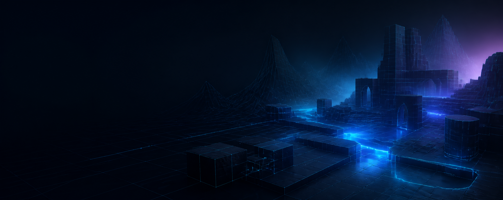

  

<h1 align="center">Mukund Pareek</h1>

  <strong>Unreal Engine Gameplay Programmer · C++ · GAS · Multiplayer Systems</strong>

  I build gameplay architecture, network-aware systems, AI, and developer tools for Unreal Engine projects.

  <a href="https://mukund-portfolio-chi.vercel.app/">Portfolio</a>
  ·
  <a href="https://twitter.com/MukundPareek">X / Twitter</a>

---

## What I build

- **Gameplay systems:** Unreal Engine C++ and Blueprint architecture for abilities, attributes, combat, movement, and interaction.
- **Multiplayer foundations:** replicated state, server-authoritative gameplay, PlayerState-owned systems, and network-aware UI.
- **Developer tools:** editor and desktop tooling that brings AI assistance into Unreal workflows without getting in the way.

## Professional focus

My studio work centers on gameplay architecture, multiplayer systems, character movement, combat, AI, and UI. Production source is held in private commercial repositories and Perforce, so the technical context is documented through case studies on my [portfolio](https://mukund-portfolio-chi.vercel.app/).

## Selected work

| Project | What it is | Stack |
| --- | --- | --- |
| [UnrealBuddy](https://github.com/MukundPareek15/Unreal-Buddy) | A screen-aware AI companion for Unreal developers, with contextual guidance, a floating prompt panel, and cursor-led UI help. | Python · AI tools · Windows |
| [Minesweeper AI Chat Plugin](https://github.com/MukundPareek15/Chatbot-GameGeneration) | An Unreal Editor plugin that turns natural-language prompts into playable Minesweeper grids directly in a Slate window. | C++ · Unreal Engine · Slate |
| [GAS System 5.3](https://github.com/MukundPareek15/GAS-System-5.3) | A focused UE 5.3 learning sandbox for replicated attributes, Gameplay Effects, abilities, and reactive UI. | C++ · Unreal Engine · GAS |
| [WWE CommonUI Menu](https://github.com/MukundPareek15/WWE_Main_Menu) | A WWE 2K-inspired front-end menu prototype built around Unreal Engine CommonUI. | Unreal Engine · CommonUI · UI |
| [Paper Project](https://github.com/MukundPareek15/Paper_Project) | A Blueprint-first 2D action-adventure prototype with combat, inventory, characters, and Paper2D/PaperZD content. | Unreal Engine · Blueprints · Paper2D |

## Toolbox

`C++` · `Unreal Engine 5` · `Gameplay Ability System` · `Replication` · `Enhanced Input` · `Blueprints` · `Slate` · `CommonUI` · `UMG` · `Python` · `AI APIs` · `Perforce`

## Beyond the code

I care about responsive gameplay, clear system boundaries, and tools that shorten the path from an idea to something testable.

If you are building something in Unreal, or want to compare notes on game systems and developer tools, feel free to reach out through my [portfolio](https://mukund-portfolio-chi.vercel.app/).
